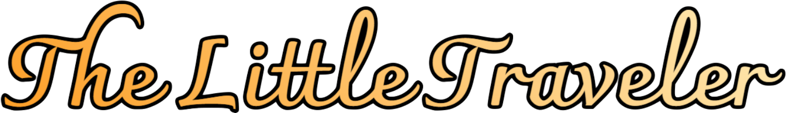
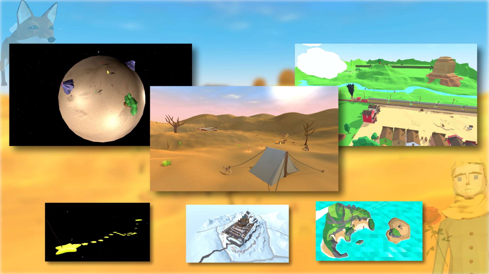
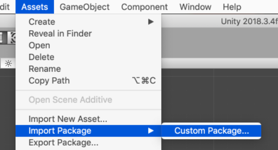

# 🤴🏻 The Little Traveler

 **어린왕자**를 의미하는 The Little Prince에서 'The Little' 그리고 **여행자**를 의미하는 'Traveler'의 합성어

<br>

<div align="center">
  <br>
  
</div>


<br>
<hr>
<br>

<div style="display:flex; justify-content: center;">
<p align="center">
    <a href="https://ko.reactjs.org/">
    
    <a href="https://ko.reactjs.org/">
    
  <a href="https://ko.reactjs.org/">
    
  <a href="https://docs.aws.amazon.com/s3/index.html?nc2=h_ql_doc_ec2">
    
  <a href="https://docs.aws.amazon.com/ec2/index.html?nc2=h_ql_doc_ec2">
    
  </a> 
  <a href="https://www.docker.com/get-started">
    
  </a>
  <a href="https://www.jenkins.io/">
    
  </a>
  <a href="https://www.atlassian.com/ko/software/jira/">
    
  </a>
  <a href="https://www.atlassian.com/ko/software/jira/">
    
  </a>
  <a href="https://www.notion.so/9afd18e7efe54feba56f48c35a99270b">
    
  </a>
</p>
</div>

<div style="display:flex; justify-content: center;">
  <p align="center">

  <h3 align="center"> 일상생활에 지친 어른들을 위한, 어린왕자 스토리를 기반으로 한 '어른들을 위한 힐링게임' 서비스입니다. </h3>

  <br>

<p align="center"> 
  <a href="http://k6d103.p.ssafy.io/">게임 시작</a> •
  <a href="https://www.notion.so/ba979739a48d4897b775e9105f50ee90">게임 상세 정보</a> 
</p>

<br>
  </p>
</div>




<br>

## 🚩 Table of Contents


- [🤴🏻 The Little Traveler](#-the-little-traveler)
  - [🚩 Table of Contents](#-table-of-contents)
    - [🤴🏻The Little Traveler?](#the-little-traveler)
  - [<font color="hotpink"> ⭐️프로젝트 주요 내용</font>](#font-colorhotpink-️프로젝트-주요-내용font)
    - [<a href="https://www.notion.so/ba979739a48d4897b775e9105f50ee90">🎨 프로젝트 상세 디자인</a>](#-프로젝트-상세-디자인)
  - [🌏 Browser Support](#-browser-support)
  - [📦 Packages (M)](#-packages-m)
  - [📚 준비하기](#-준비하기)
  - [🏁 실행하기](#-실행하기)
    - [🖥 배포하기](#-배포하기)
  - [💬 Documents](#-documents)
      - [1. The Little Traveler - Notion](#1-the-little-traveler---notion)
      - [2. 와이어프레임](#2-와이어프레임)
      - [3. 시나리오](#3-시나리오)
      - [4. 우선순위명세서](#4-우선순위명세서)
      - [5. 프로젝트 월별 계획표](#5-프로젝트-월별-계획표)
      - [6. 게임 운영](#6-게임-운영)


  - [👥 Contributer](#-contributer)
  - [🚀 References](#-references)
  - [📜 License](#-license)

<br>

### 🤴🏻The Little Traveler?
<br>

 일상에 지친 어른들을 위로하고자 시작한 저희의 프로젝트는 어린왕자 스토리를 기반으로 한 <font size="2" color="orange">**_'어른들을 위한 힐링게임'_**</font> 서비스입니다. 서비스를 간단히 요약하자면, 주요 기획 의도는 <strong>개발진의 역량 향상</strong>과 <strong>유니티 게임 서비스 개발 경험</strong>이였습니다. 그래서 맵 디자인부터 자체적으로 개발을 하고 다양한 게임 서비스를 분석하면서 최대한 사용자의 재미를 생각한 힐링게임을 제공하고자 하였습니다.
 
<br>
<h3><font color="hotpink">프로젝트 기획 배경</font></h3>

<h5>프로젝트 기획 배경은 다음과 같습니다.</h5>
<ul>
	<li>✔️어린왕자 동화 메인 스토리를 따라가는 퀘스트 제공</li>
	<li>✔️다채로운 쉽고 재미있는 미니 게임 제공</li>
	<li>✔️역량 향상 :  <code><font color="skyblue"><b>C#</b></font></code>,<code><font color="skyblue"><b>React</b></font></code>, <code><font color="skyblue"><b>Unity</b></font></code>, 	<code><font color="skyblue"><b>WebGL</b></font></code>, <code><font color="skyblue"><b>Unity Plastic SCM</b></font></code>, <code><font color="skyblueblue"><b>Docker</b></font></code>, <code><font color="skyblueblue"><b>Jenkins</b></font></code>, <code><font color="skyblueblue"><b>NGINX</b></font></code></li>, <code><font color="skyblueblue"><b>JIRA</b></font></code></li>, <code><font color="skyblueblue"><b>Gitlab</b></font></code></li>

<br/>


## <font color="hotpink"> ⭐️프로젝트 주요 내용</font>


* [**상세 설명✔️**] 
    
    * 소설속의 B612,초원,사막 등 맵을 완벽 구현하여 상상속의 공간을 직접 경험
    * 장미 물주기, 여우 길들이기 등 소설속의 다양한 퀘스트 수록
    * 사용자를 위한 월드맵과 지역맵 제공
    * 자연 친화적인 장작소리,파도소리,새소리 등 ASMR 힐링 사운드 제공
    * 시시각각 변하는 하늘과 다채로운 맵 디자인
    * 낚시 / 말타기와 같은 재미요소
    * 인내의 별에서 양 얻기 게임
    * 초원 맵에서 장미미로 탈출게임
    * B612,초원,사막,바다,싸피왕국까지 총 25개의 별모으기 게임
  
<br>

* [**상세 기능✔️**]
  * 북마크 기능 제공
  * 배경음/효과음 등 환경설정 변경 기능
  * F2키 단축키/월드맵/현재맵 기능
  * 장작타는소리,파도 소리,새소리 등 ASMR기능
  * 대화시스템, 낚시,말타기,날씨, 카메라 인칭변경 기능
  * 캐릭터 걷기/뛰기/달리기 등 이동 기능
  * 퀘스트 완료 여부 확인 및 별 모으기 기능
  
<br>

### <a href="https://www.notion.so/ba979739a48d4897b775e9105f50ee90">🎨 프로젝트 상세 디자인</a> 

<br>

## 🌏 Browser Support

|  Chrome |  Internet Explorer |  Edge |  Safari |  Firefox |
| :---------: | :---------: | :---------: | :---------: | :---------: |
| Yes | 10+ | Yes | Yes | Yes |

## 📦 Packages (M)

1. **Game**

   | Name                  | Description                                                                          |
   | --------------------- | ------------------------------------------------------------------------------------ |
   | WebGL                 | It is provided so that you can use interactive 3D graphics in a web browser.             |
   | Unity Plastic SCM | A version control and source code management tool built to improve team collaboration and scalability no matter what engine you use.                                                        |
   | react                 | React is a JavaScript library for building user interfaces.                          |

<br>

## 📚 준비하기

> Unity설치, Frontend 모듈 다운로드 해주시면 됩니다.

1. Git clone 받기

```
git clone https://lab.ssafy.com/s06-final/S06P31D103.git
```

2. [**Frontend**] 모듈 다운로드

```bash
# frontend 폴더로 이동
cd frontend/

yarn install
-------------------
npm install
```

3. 이 프로젝트의 Unity 패키지를 다운로드합니다.
   
   자신의 Unity 프로젝트에서 Unity 편집기 메뉴에서 “Assets” → “Import Package” → “Custom Package”를 선택하여 Readme를 추가합니다.
  

읽어보기 내용을 편집하는 방법
<details>
먼저 Unity 에디터의 "Inspector" 탭에 Readme가 표시되는지 확인합니다. 그런 다음 "검사기" 탭의 오른쪽에 있는 드롭다운 메뉴를 클릭하고 "디버그" 옵션을 선택하여 파일을 편집할 수 있습니다.

읽어보기 내용은 "섹션"으로 나뉩니다. 각 섹션에는 "제목"과 "텍스트" 본문이 있습니다.

각 섹션에는 선택적 "링크 텍스트" 및 "URL" 필드가 있을 수 있습니다. 이 두 필드를 모두 추가하면 사용자가 웹 브라우저에서 링크를 열 수 있습니다.

Readme에 더 많은 섹션을 추가하려면 "섹션" 상단의 "크기" 필드를 변경하십시오.

이 인스펙터에 사용된 현재 아이콘은 »Readme / Icons / Readme_Builder.png에서 찾을 수 있습니다.

아이콘에는 모든 PNG 파일(및 파일 이름)을 사용할 수 있습니다.

프로젝트에 새 아이콘을 추가합니다.
Unity 인스펙터에서 아이콘의 "텍스처 유형"을 "에디터 GUI 및 레거시 GUI"로 변경합니다.
그런 다음 Readme 관리자의 "디버그" 버전을 열고 새 아이콘을 "아이콘" 필드로 드래그합니다.
고급 편집 기술
Unity의 "디버그" 화면에서 "텍스트" 필드에 긴 텍스트를 추가하는 것은 번거롭습니다.

Readme 파일은 텍스트 편집기에서 이 프로젝트의 "Readme.asset" 파일을 열어 편집할 수도 있습니다. 파일은 Yaml 구문으로 되어 있으며 UTF-8 문자를 포함할 수 있습니다.

예를 들어 이 섹션은 텍스트 편집기를 사용하여 작성되었으며 Yaml "|-"(파이프 및 대시) 문자를 사용하여 단일 yaml 값에 여러 줄 텍스트를 추가합니다.
</details>

<br>

## 🏁 실행하기
**Front-end**

```bash
# frontend 폴더로 이동
cd frontend/

yarn run server
-------------------------
npm run start
```

### 🖥 배포하기

해당 서비스는 AWS EC2를 통해 배포하였고
Docker와 Jenkins를 이용해 CI/CD 구축하였습니다:

1. AWS EC2 인스턴스 생성 (ubuntu)
2. docker 설치
3. 필요한 이미지를 docker hub를 통해 설치
   1. Jenkins
4. Jenkins와 Gitlab repository 연동
5. Nginx 설정 (frontend/nginx 폴더의 homepage.conf)
6. frontend 폴더 안에 dockerfile 작성
7. 프로젝트 root 위치에 Jenkins 파일 작성
   1. Build and Test 과정
   2. Build (frontend)
   3. Run (컨테이너 실행)
8. `docker ps` 를 통해 frontend 컨테이너가 실행되는 것을 확인 (Jenkins 포함)

<br />

## 💬 Documents

#### 1. [The Little Traveler - Notion](https://www.notion.so/The-Little-Traveler-44489e1dcbf041e995a87ad363179fd3)
#### 2. [와이어프레임](https://www.notion.so/50d8ccd57549483991f86b6a641b8793)
#### 3. [시나리오](https://www.notion.so/abb388cddb22420ebf22e472c357ab6e)
#### 4. [우선순위명세서](https://www.notion.so/e76f3a53a348416fb19535fab82bce7c?v=e2cd928531c24deaa40e2359bed56f11)
#### 5. [프로젝트 월별 계획표](https://www.notion.so/11134f5df1f14296b695d1fa6afad61c)
#### 6. [게임 운영](https://www.notion.so/a7ee0db13234402292af744f110b8498)

<br>

## 👥 Contributer

#### [박유정](https://github.com/elenaisnanocat)
* 담당 개발 : 맵 모델링, 사운드 시스템, 날씨 시스템, 낚시 애니메이션 기능, 효과음 기능 개발
* 팀내 역할 : 팀장, 기획총괄
* 개발 각오: 다들 처음 유니티 사용해서 프로젝트 하는데 잘 완성되어서 좋은 결과가 있었으면 좋겠습니다!!
* 후기 : 좋은 팀원들을 만났고 덕분에 함께 했을때의 시너지 효과를 경험했습니다. 다들 처음해보는 유니티 게임 개발 엔진이지만 으쌰으쌰 서로 모르는 부분은 도와주고 하며 좋은 경험이었습니다. 네이버폼을 사용해 실제 사용자들도 받고 피드백도 받아보고 이를 토대로 사용자들의 편의를 개선시켜주는 등 개발 이후의 버그 수정 경험을 해 볼 수 있어서 좋았습니다.
#### [정종혁](https://github.com/jjong60)
* 담당 개발 : 캐릭터 모델링, 캐릭터 애니메이션(기본 움직임), 카메라 시점, 퀘스트 시스템, 대화 시스템, 메뉴창, 인벤토리, BGM, SE, 
* 팀내 역할 : 운영총괄
* 개발 각오 : 꼭 상을 타겠습니다!
* 후기 : 유니티, C#을 처음 배워보면서 어려운 점도 많았고 상태관리가 git이랑 달라 당황했던 경험이 있었지만 게임 개발이라는 주제로 정말 재밌는 기획도 많이 생각했고 직접 만든다는 경험이 하루하루가 즐거웠습니다. 또한 이렇게 즐기며 프로젝트 한 결과가 좋은 결과 나와서 더 뿌듯합니다!
#### [박현진](https://github.com/jinnydiary)
* 담당 개발 : 말타기, 낚시 및 아이템 찾기&획득 기능, 조종사 퀘스트, 씬 연결 구현, 월드맵 제작, 서버 배포
* 팀내 역할 : 헬퍼
* 개발 각오 : 9-6 동안은 열심히 해보자!
* 후기 : 처음 해보는 유니티와 C#을 6주 안에 익히고 구현까지 할 수 있을지 걱정이 많이 되었는데 완성도 높은 결과물이 나와서 너무 뿌듯해요! 개발자로서 한 발짝 더 다가갈 수 있어, 좋은 팀원들은 만날 수 있어 좋았습니다:) 프로젝트는 끝이 났지만 기회가 있다면 유지 보수를 하여 더 나은 게임을 계속해서 유지시키고 싶습니다!
#### [김동현](https://github.com/dtc03003)
* 담당개발 : 대화시스템 , 퀘스트 시스템 , WebGL 빌드, 프론트
* 팀내역활 : 부팀장
* 개발 각오 : 매일매일 새로 배우며 성장중! 같이 성장합시다!
* 후기 : 모두가 처음 해보는 유니티&C#으로 해본 프로젝트! 좋은 결과도 기대되서 좋은 경험이었습니다.
#### [박기성](https://github.com/abc1242)
* 담당개발 : B612 맵 모델링, B612 기능, 인내의 별
* 팀내역할 : 우주인
* 개발 각오 : 맡은 역할에 최선을 다하겠습니다.
* 후기 : 처음 해보는 유니티 프로젝트이지만 분위기가 좋아 개발하는 매일매일이 행복했습니다. 팀원 모두 열심히 한만큼 좋은 결과가 있어 뿌듯합니다.
#### [최영빈](https://github.com/chldudqlsdl)
* 담당개발 :  초원 모델링, 시네마틱 영상
* 팀내역할 : 스토리 작가
* 개발각오 : 게임 사용자의 입장에서 재미있는 게임을 만들고 싶습니다.
* 후기 : 평생 살면서 익숙하게 봐왔던, 캐릭터의 움직임이나 NPC와의 대화의 구현등이 개발자들의 섬세한 노력에 의해서 어렵게 이루어진다는 것을 깨달았습니다. 게임 구현의 완성도 측면에 있어서는 팀원 모두의 노력으로 높은 수준을 달성한 듯 합니다. 다만 실제 사용자들의 피드백에 의하면 개인의 플레이 환경에 따라 마우스 민감도, 운영체제가 달라 모두가 똑같은 사용 경험을 얻을 수 없다는 점이 아쉬워 이 부분을 개선 할 수 있었으면 좋겠습니다. 가끔 미세한 버그도 발생하는 듯 한데 게임 개발의 숙명인 듯 합니다. 시간을 두고 테스트를 하면서 빈틈없는 게임이 되면 좋겠습니다. 

<br>

## 🚀 References


- [Duggy - B612 배경 사운드](https://www.youtube.com/watch?v=syn-DeJ7sBk)

<br>

## 📜 License

This software is licensed under the [MIT](.docs/LICENSE) © [SSAFY](https://www.ssafy.com/ksp/jsp/swp/swpMain.jsp).
